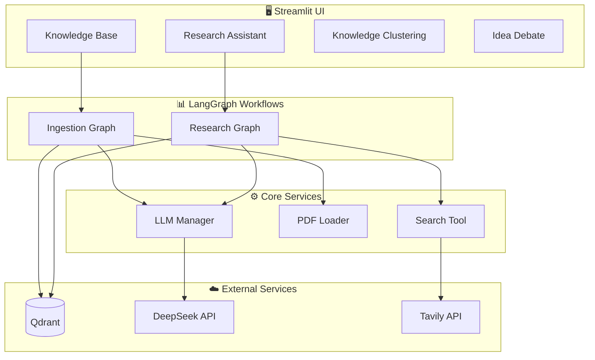

# 🎓 Academic Agent

**Academic Agent** 是一个基于 **LangGraph**、**DeepSeek** 和 **Qdrant** 构建的自主学术研究助手系统。它结合了 **Visual RAG** 技术深度理解 PDF 论文内容，并利用多智能体协作辅助研究工作。

[](https://python.org)
[](https://langchain-ai.github.io/langgraph/)
[](https://streamlit.io/)
[](LICENSE)

---

## ✨ 核心功能

### 📚 智能知识库 (Knowledge Base)

- **Visual RAG**: 利用视觉大模型 (Qwen-VL) 直接"阅读"论文页面，精准提取图表、公式和布局信息
- **元数据提取**: 自动识别论文标题、作者、摘要、发表年份等关键信息
- **联网补全**: 通过 Tavily 搜索补全论文的引用量、最新评价等外部信息
- **向量索引**: 使用 Qwen/OpenAI Embedding 将知识存入 Qdrant 向量数据库

### 🧠 研究助手 (Research Assistant)

- **学术问答**: 基于知识库准确回答论文细节、方法论、实验结果等问题
- **智能路由**: 自动判断问题类型，决定使用本地知识库还是联网搜索
- **综述撰写**: (Beta) 根据多篇论文内容自动规划并撰写学术综述草稿

### 🧬 知识聚类 (Knowledge Clustering)

- **多维语义分析**: 定义多个研究主题，自动计算论文与各主题的关联强度
- **可视化展示**: 直观展示每篇论文在不同研究方向上的得分
- **严格过滤**: 支持基于关键词匹配的严格筛选模式

### ⚔️ 观点辩论 (Idea Debate)

- **对抗竞技场**: 两个 AI 智能体 (Builder vs Critic) 进行多轮辩论
- **Builder**: 负责提出方案、完善细节，不断优化应对挑战
- **Critic**: 负责寻找漏洞、提出质疑，直到方案无懈可击
- **思维链优化**: 通过对抗过程产出更加严谨的研究方案

---

## 🏗️ 系统架构



---

## 🛠️ 技术栈

| 类别 | 技术 |
|------|------|
| **编排框架** | [LangGraph](https://langchain-ai.github.io/langgraph/) (Stateful Agents) |
| **推理模型** | DeepSeek Reasoner (R1) |
| **提取模型** | Qwen-VL / DeepSeek Chat |
| **批评模型** | Qwen3-Max |
| **Embedding** | Qwen Text Embedding v4 |
| **向量数据库** | [Qdrant](https://qdrant.tech/) |
| **联网搜索** | [Tavily](https://tavily.com/) |
| **用户界面** | [Streamlit](https://streamlit.io/) |
| **PDF 处理** | PyMuPDF |

---

## 🚀 快速开始

### 前置要求

- Python 3.10+
- API Keys:
  - **DeepSeek** (推理/对话)
  - **DashScope/Aliyun** (Embedding & Qwen-VL)
  - **Qdrant** (向量存储)
  - **Tavily** (联网搜索)

### 安装步骤

1. **克隆项目**

   ```bash
   git clone https://github.com/konxx/academic-agent.git
   cd academic-agent
   ```

2. **创建虚拟环境**

   ```bash
   python -m venv venv

   # Windows
   .\venv\Scripts\activate

   # Linux/Mac
   source venv/bin/activate
   ```

3. **安装依赖**

   ```bash
   # 使用 pyproject.toml 安装依赖
   pip install -e .
   ```

### 配置环境变量

1. 复制示例配置文件：

   ```bash
   cp .env.example .env
   ```

2. 编辑 `.env` 文件，填入你的 API Key：

   ```ini
   # === Agent 模型 (DeepSeek Reasoner) ===
   AGENT_API_KEY=sk-xxxx
   AGENT_MODEL_NAME=deepseek-reasoner

   # === Critic 模型 (Qwen3-Max) ===
   CRITIC_API_KEY=sk-xxxx
   CRITIC_MODEL_NAME=qwen3-max

   # === Extractor 模型 (Qwen-VL) ===
   EXTRACTOR_API_KEY=sk-xxxx
   EXTRACTOR_MODEL_NAME=qwen3-vl-plus

   # === Embedding 模型 ===
   EMBEDDING_API_KEY=sk-xxxx
   EMBEDDING_MODEL_NAME=text-embedding-v4

   # === Qdrant 向量数据库 ===
   QDRANT_URL=https://xyz.qdrant.tech
   QDRANT_API_KEY=th-xxxx
   QDRANT_COLLECTION_NAME=academic_knowledge

   # === Tavily 搜索 ===
   TAVILY_API_KEY=tvly-xxxx
   ```

### 运行应用

```bash
streamlit run ui/app.py
```

访问 `http://localhost:8501` 即可开始使用。

---

## 📂 项目结构

```text
academic-agent/
├── config/                  # 配置模块
│   ├── prompts/             # Prompt 模板文件
│   └── settings.py          # Pydantic Settings 配置类
├── core/                    # 核心服务层
│   ├── llm.py               # LLM 管理器 (Agent/Extractor/Critic/Embedding)
│   ├── pdf_loader.py        # PDF 转图片 (Visual RAG)
│   ├── qdrant.py            # Qdrant 数据库管理器
│   ├── search.py            # Tavily 搜索封装
│   └── text_splitter.py     # 文本分块器
├── graph/                   # LangGraph 工作流
│   ├── ingestion/           # 论文入库工作流
│   │   ├── nodes.py         # 节点定义 (提取/修复/入库)
│   │   ├── state.py         # State 类型定义
│   │   └── workflow.py      # 图构建与编译
│   └── research/            # 研究问答工作流
│       ├── nodes.py         # 节点定义 (检索/路由/搜索/写作)
│       ├── state.py         # State 类型定义
│       └── workflow.py      # 图构建与编译
├── ui/                      # Streamlit 前端
│   ├── app.py               # 主入口
│   ├── components/          # 可复用组件
│   │   ├── chat_interface.py
│   │   ├── pdf_uploader.py
│   │   └── state_visualizer.py
│   └── pages/               # 功能页面
│       ├── 1_Knowledge_Base.py
│       ├── 2_Research_Assistant.py
│       ├── 3_Knowledge_Clustering.py
│       └── 4_Idea_Debate.py
├── utils/                   # 工具函数
│   └── logger.py            # 日志配置
├── .env.example             # 环境变量示例
├── pyproject.toml           # 项目元数据 & 依赖
├── requirements.txt         # Python 依赖列表
└── zeabur.toml              # Zeabur 部署配置
```

---

## 🔧 开发指南

### 测试模型连接

```bash
# 测试 LLM 连接
python -m core.llm

# 测试 Qdrant 连接
python -m core.qdrant

# 检查配置加载
python -m config.settings
```

### 代码规范

项目使用 `ruff` 进行代码检查：

```bash
# 安装开发依赖
pip install -e ".[dev]"

# 运行代码检查
ruff check .

# 自动修复
ruff check --fix .
```

---

## 🌐 部署

项目已配置 Zeabur 一键部署，详见 `zeabur.toml`。

---

## 📄 许可证

本项目采用 [MIT 许可证](LICENSE)。

---

## 🤝 贡献

欢迎提交 Issue 和 Pull Request！
